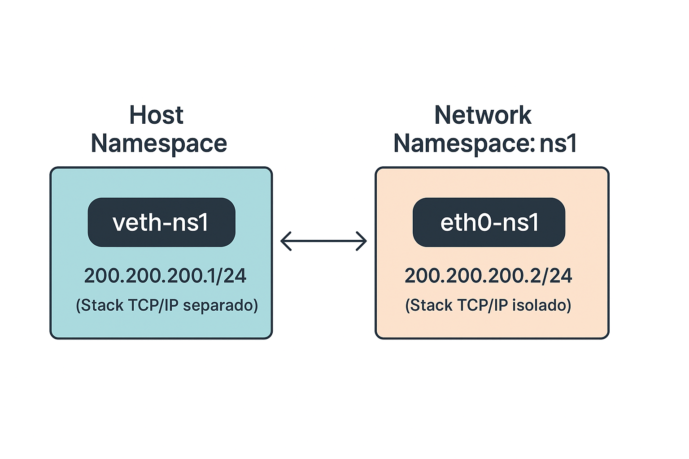
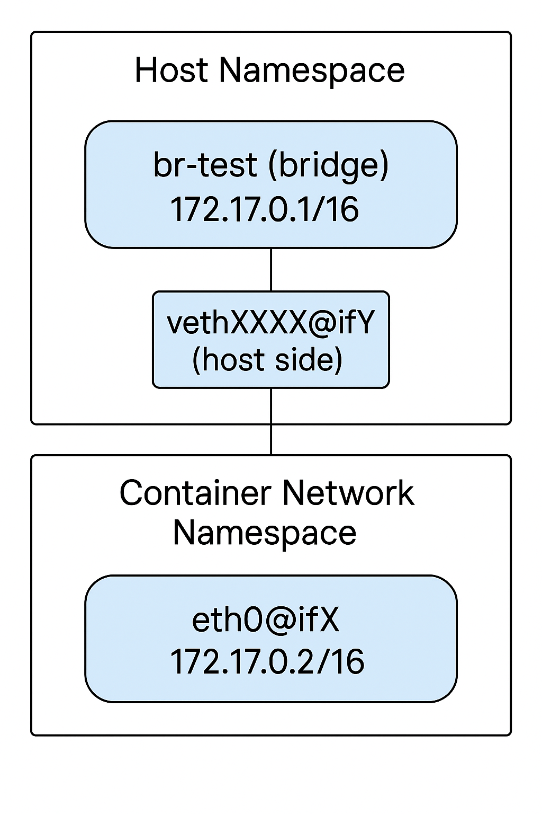
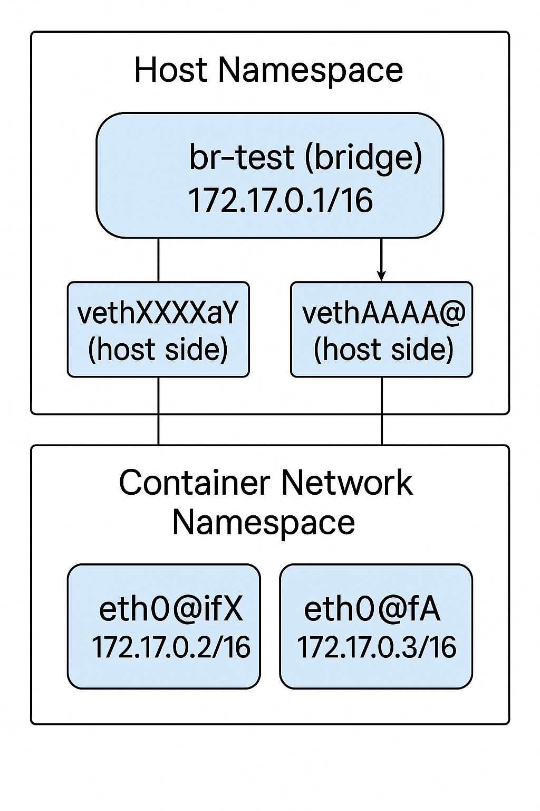

# Criando rede no container

Antes de tudo, precisamos colocar dentro de nosso ./jail o binário "ip". Desta forma podemos analisar o endereço ip dentro do container.

```bash
cp /usr/sbin/ip ./jail/sbin/
ldd /usr/sbin/ip
	linux-vdso.so.1 (0x000075cb54060000)
	libbpf.so.0 => /lib/x86_64-linux-gnu/libbpf.so.0 (0x000075cb53ef3000)
	libelf.so.1 => /lib/x86_64-linux-gnu/libelf.so.1 (0x000075cb53ed5000)
	libmnl.so.0 => /lib/x86_64-linux-gnu/libmnl.so.0 (0x000075cb53ecd000)
	libbsd.so.0 => /lib/x86_64-linux-gnu/libbsd.so.0 (0x000075cb53eb5000)
	libcap.so.2 => /lib/x86_64-linux-gnu/libcap.so.2 (0x000075cb53eaa000)
	libc.so.6 => /lib/x86_64-linux-gnu/libc.so.6 (0x000075cb53c00000)
	libz.so.1 => /lib/x86_64-linux-gnu/libz.so.1 (0x000075cb53e8c000)
	/lib64/ld-linux-x86-64.so.2 (0x000075cb54062000)
	libmd.so.0 => /lib/x86_64-linux-gnu/libmd.so.0 (0x000075cb53e7f000)

 cp /lib/x86_64-linux-gnu/{libbpf.so.0,libelf.so.1,libmnl.so.0,libbsd.so.0,libcap.so.2} ./jail//lib/x86_64-linux-gnu/
 cp /lib/x86_64-linux-gnu/{libc.so.6,libz.so.1} ./jail/lib/x86_64-linux-gnu/
 cp /lib/x86_64-linux-gnu/libmd.so.0 ./jail/lib/x86_64-linux-gnu/libmd.so.0
```

Agora vamos iniciar nosso container, não esqueca de utilizar o namespace **--net** para isolamento de rede

```bash
unshare   --mount   --uts   --ipc   --pid   --fork  --user --net --map-root-user   bash -c "
    mount -t proc proc ./jail/proc &&
    chroot ./jail
  "
```

Ao iniciar nosso container com isolamento de rede, nele haverá apenas interface de loopback. para conectá-lo ao mundo externo pela rede, temos que realizar uma ligação interna no kernel de uma interface em nosso host (ou melhor, no namespace atual do nosso linux), com outra interface dentro do namespace do processo do nosso container.

Esse tipo de ligação é realizado com interface do tipo **veth**. Ela funciona como duas "interfaces de rede" com um "cabo de rede" interligando-as diretamente. Mas tudo isso é virtual dentro do kernel.

## Opção 01: Ligação direta do container com o host

<p align="center">
  
</p>

1 - Inicialize o jail com namespace de network, observe que tem apenas a interface de **loopback**

Obs. É necessário colocar dentro do `jail` o programa `ip`

```bash
sudo unshare -p -f -n --mount-proc=./jail/proc chroot jail
ip a
```

2 - Em outro terminal, vamos cria a veth pair

```bash
ip link add veth-host type veth peer name veth-jail
```

Agora temos um par de interfaces:

- `veth-host` <==> `veth-jail`

3 - Coloca veth-jail no namespace do PID do jail

Busque o PID do processo do jail com `ps aux` coloque-o na variável PID

```bash
PID=139502
ip link set veth-jail netns $PID
```

No terminal do jail, executer `ip  a` e você verá a interface veth_jail lá dentro

4 - Configura host

```bash
ip addr add 192.168.100.1/24 dev veth-host
ip link set veth-host up
```

5 - Configura dentro do jail

```bash
nsenter -t $PID -n ip addr add 192.168.100.2/24 dev veth-jail
nsenter -t $PID -n ip link set veth-jail up
nsenter -t $PID -n ip link set lo up
```

## Outra opção 02: Ligando o container com uma brigde

Este modelo é semelhante a network do docker, para cada network criada o docker criar uma bridge, que tem nome de docker0, por padrão ela vem com ip 172.17.0.0/16, igual a figura abaixo.

<p align="center">
  
</p>

Para configuração, repita todos os passos passado e depois:
1 - Crie uma bridge

```bash
sudo ip link add name br-test type bridge
sudo ip link set br-test up
```

2 - Adicione a interface do lado do host (veth-ns1) à bridge

```bash
sudo ip link set veth-ns1 master br-test
```

Desta forma, a bridge atua como um switch, permitindo que outros container que estiverem também conectados na bridge se comuniquem.

Lembrando que para isso, retiraremos o IP da interface veth-ns1, e colocamos na interface da Bridge.

<p align="center">
  
</p>

Ainda falta mais uma coisinha para permitir essa comunicação entre os containers...
No docker, é criado algumas regras de firewall para que as interfaces veth ligadas à bridge possam se comunicar, aqui faremos diferente. Vamos subir um módulo específico do kernel, e permitir essa transferência de dados entre as interfaces.

```bash
modprobe br_netfilter
sudo sysctl -w net.bridge.bridge-nf-call-iptables=0
sudo sysctl -w net.bridge.bridge-nf-call-ip6tables=0
sudo sysctl -w net.bridge.bridge-nf-call-arptables=0
```

### 1.4 Crie dispositivos básicos:

```bash
sudo mknod -m 666 ./jail/dev/null c 1 3
sudo mknod -m 666 ./jail/dev/zero c 1 5
```
